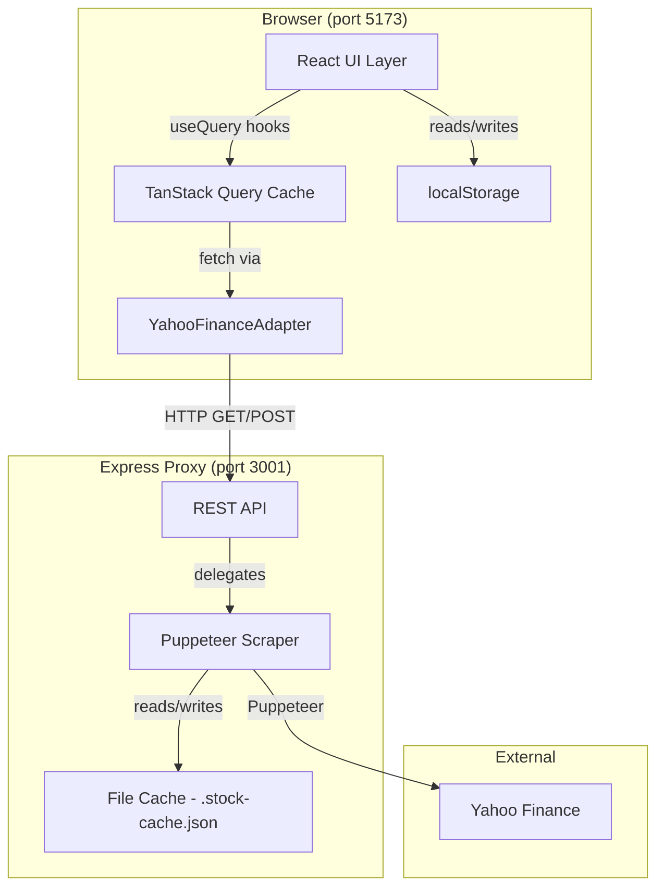

# Design Document: Stox Stock Ticker App

## Overview

Stox is a React + TypeScript web application that displays a live, scrollable table of stock tickers with key financial metrics sourced from Yahoo Finance via a Puppeteer-based Express proxy server. Users can add/remove tickers, star favorites, sort/filter/search the table (including multi-column sort), resize columns, view a heatmap visualization, see related tickers and EPS multiples via hover popovers, export data as CSV, and have their configuration persisted across sessions via browser localStorage.

The architecture is a two-tier system: a React SPA frontend (Vite, port 5173) communicating with an Express proxy backend (port 3001) that uses Puppeteer to scrape Yahoo Finance. TanStack Query manages frontend fetch state, caching, and background refresh. Computed columns (Book Value, P:Book, Tangible Book Value, P:Tangbook, 20x EPS, 15x EPS, Price/Earnings) are derived in the client from raw fetched values.

### Key Design Decisions

- **Express + Puppeteer backend proxy**: Yahoo Finance data is fetched server-side via Puppeteer scraping across multiple Yahoo Finance pages (quote summary, real-time price, balance sheet, profile, related tickers). This avoids CORS issues and allows multi-stage data aggregation.
- **Server-side caching**: Scraped data is cached with a 4-hour TTL in `.stock-cache.json` on disk, with a 2-second throttle between requests to avoid rate limiting.
- **localStorage for persistence**: Ticker list (`stox:tickers`) and starred tickers (`stox:starred`) are stored in localStorage as JSON arrays. No server-side persistence is needed.
- **TanStack Query**: Manages per-ticker fetch state, caching, and the 5-minute auto-refresh interval via `refetchInterval` and `staleTime`. Retries with exponential backoff (2s, 4s, 8s).
- **Vite**: Build tool for fast HMR and simple project setup.
- **No Interest/Annotation column**: The original Interest column was removed. Starred tickers replaced per-ticker annotations.
- **Yahoo fallback values**: `computeStockRow` falls back to Yahoo's pre-computed `bookValue` and `priceToBook` when balance sheet data is unavailable.

---

## Architecture



### Layer Responsibilities

| Layer | Responsibility |
|---|---|
| UI Components | Render table, heatmap, popovers, dialogs; handle user interactions; display loading/error states |
| TanStack Query | Fetch orchestration, caching, background refresh (5 min), per-ticker query state, retry with backoff |
| YahooFinanceAdapter | Concrete adapter that fetches from the Express proxy; normalizes response into `RawStockData` |
| Express Proxy Server | REST API endpoints; delegates to Puppeteer scraper; manages CORS, validation, abort signals |
| Puppeteer Scraper | Multi-stage Yahoo Finance scraping (quote summary, price, balance sheet, profile, related tickers); caching with 4h TTL; throttling |
| Computed Column Logic | Pure functions that derive computed fields from `RawStockData` with Yahoo fallbacks |
| localStorage Service | Read/write ticker list and starred tickers; in-memory fallback when localStorage unavailable |
| CSV Exporter | Generate RFC 4180 CSV string from current table rows; trigger browser download |
| Heatmap Colors | Pure functions mapping financial values to pastel RGB colors for daily change and P:Book |

---

## Components and Interfaces

### Component Tree

```
App
├── TickerTable
│   ├── Heatmap (collapsible, dual-mode: daily/intrinsic)
│   ├── ToolBar
│   │   ├── SearchInput
│   │   ├── AddTickerForm (comma-separated)
│   │   ├── ExportButton
│   │   ├── HelpButton (?)
│   │   └── RefreshButton (⟳)
│   ├── TableHeader (sortable, resizable, multi-column sort)
│   └── StockRowWithData[] (one per ticker)
│       └── StockRow
│           ├── TickerCell (link to Yahoo Finance, related tickers popover)
│           ├── EpsCell (hover popover with 15x/20x multiples)
│           ├── DataCells (formatted, color-coded)
│           └── RowActions (star toggle, remove button)
├── EmptyState (with inline AddTickerForm and HelpButton)
├── Footer
└── HelpDialog (portal-based modal)
```

### Key Component Interfaces

```typescript
// ToolBar props
interface ToolBarProps {
  searchQuery: string;
  onSearchChange: (q: string) => void;
  onAddTicker: (symbol: string) => string | null;
  onExport: () => void;
  hasData: boolean;
  onRefresh: () => void;
  isRefreshing: boolean;
  onHelpOpen: () => void;
}

// TableHeader props
interface TableHeaderProps {
  sortCriteria: SortCriterion[];
  onSort: (col: SortKey, multi?: boolean) => void;
  columnWidths: Record<ColumnKey, number>;
  onResizeStart: (key: ColumnKey, e: React.MouseEvent) => void;
  onAutoFit: (key: ColumnKey) => void;
  isResizingRef: RefObject<boolean>;
}

// StockRow props
interface StockRowProps {
  ticker: string;
  data: StockRowData | null;
  isLoading: boolean;
  isError: boolean;
  onRemove: (ticker: string) => void;
  relatedTickers?: string[];
  allTickers: string[];
  onAddTicker: (ticker: string) => void;
  isStarred: boolean;
  onToggleStar: (ticker: string) => void;
}

// Heatmap props
interface HeatmapProps {
  rowDataMap: Map<string, StockRowData | null>;
  tickers: string[];
  dataVersion: number;  // bust memoisation on mutable map changes
}

// HelpDialog props
interface HelpDialogProps {
  open: boolean;
  onClose: () => void;
}

// EmptyState props
interface EmptyStateProps {
  onAddTicker: (symbol: string) => string | null;
  onHelpOpen: () => void;
}

// AddTickerForm props
interface AddTickerFormProps {
  onAddTicker: (symbol: string) => string | null;
  placeholder?: string;
  inputLabel?: string;
}
```

### Custom Hooks

| Hook | Purpose |
|---|---|
| `useTickerList()` | Read/write ticker list from localStorage; returns `[tickers, addTicker, removeTicker]`. `addTicker` supports comma-separated input, rejects empty strings and duplicates, auto-uppercases symbols. |
| `useStarredTickers()` | Read/write starred tickers from localStorage; returns `[starredSet, toggleStar]` |
| `useStockData(ticker)` | TanStack Query wrapper per ticker with 5-min `refetchInterval` and `staleTime`, exponential backoff retry (3 attempts); returns `{ data: RawStockData | null, isLoading, isError }` |
| `useTableState()` | Manages search query and multi-column sort criteria (plain click = single sort with 3-click cycle, Shift+click = multi-sort add/toggle/remove); exposes `filterTickers` and `sortRows` functions |
| `useColumnResize()` | Manages per-column widths with drag-to-resize and double-click auto-fit (Google Sheets style); provides `tableRef`, `columnWidths`, `onResizeStart`, `onAutoFit`, `isResizingRef` |

---

## Data Models

### RawStockData

Raw values returned from the proxy server via the data adapter:

```typescript
interface RawStockData {
  ticker: string;
  price: number | null;
  changePercent: number | null;       // daily price change percentage
  date: string | null;                // ISO date string of last fetch
  sector: string | null;              // business sector (e.g., "Technology")
  industry: string | null;            // industry (e.g., "Consumer Electronics")
  divYield: number | null;            // dividend yield as dollar amount
  eps: number | null;
  totalAssets: number | null;
  goodwillNet: number | null;
  intangiblesNet: number | null;
  liabilitiesTotal: number | null;
  sharesOutstanding: number | null;
  dividendPercent: number | null;
  bookValue?: number | null;          // Yahoo pre-computed book value per share (fallback)
  priceToBook?: number | null;        // Yahoo pre-computed P:Book ratio (fallback)
  relatedTickers?: string[];          // related ticker symbols from Yahoo Finance
}
```

### StockRowData (computed)

Derived from `RawStockData` by `computeStockRow()`:

```typescript
interface StockRowData {
  ticker: string;
  price: number | null;
  changePercent: number | null;
  date: string | null;
  sector: string | null;
  industry: string | null;
  divYield: number | null;
  eps: number | null;
  totalAssets: number | null;
  goodwillNet: number | null;
  intangiblesNet: number | null;
  liabilitiesTotal: number | null;
  sharesOutstanding: number | null;
  bookValue: number | null;             // (totalAssets - liabilitiesTotal) / sharesOutstanding, or Yahoo fallback
  pBook: number | null;                 // price / bookValue, or Yahoo fallback
  tangibleBookValue: number | null;     // bookValue - (goodwillNet + intangiblesNet) / sharesOutstanding
  pTangbook: number | null;             // price / tangibleBookValue
  dividendPercent: number | null;       // defaults to 0 when null
  eps20x: number | null;                // 20 * eps (shown in EPS tooltip only)
  eps15x: number | null;                // 15 * eps (shown in EPS tooltip only)
  priceEarnings: number | null;         // price / eps
}
```

### Sort Types

```typescript
type SortKey = ColumnKey | 'star';

interface SortCriterion {
  column: SortKey;
  direction: 'asc' | 'desc';
}
```

### ColumnKey

```typescript
type ColumnKey =
  | 'ticker' | 'price' | 'sector' | 'industry' | 'divYield' | 'eps'
  | 'totalAssets' | 'goodwillNet' | 'intangiblesNet' | 'liabilitiesTotal'
  | 'sharesOutstanding' | 'bookValue' | 'pBook' | 'tangibleBookValue'
  | 'pTangbook' | 'dividendPercent' | 'eps20x' | 'eps15x'
  | 'priceEarnings';
```

### Column Metadata

```typescript
interface ColumnDef {
  key: ColumnKey;
  label: string;
  type: FormatType;       // 'text' | 'currency' | 'percent' | 'ratio' | 'large-number' | 'large-count'
  sortType: 'alpha' | 'numeric';
}
```

The 17 displayed columns in order (eps20x and eps15x are computed but shown only in the EPS hover tooltip):

| # | Key | Label | Type | Sort |
|---|---|---|---|---|
| 1 | ticker | Ticker | text | alpha |
| 2 | price | Price | currency | numeric |
| 3 | sector | Sector | text | alpha |
| 4 | industry | Industry | text | alpha |
| 5 | divYield | Div Yield | currency | numeric |
| 6 | eps | EPS | currency | numeric |
| 7 | totalAssets | Total Assets | large-number | numeric |
| 8 | goodwillNet | Goodwill, Net | large-number | numeric |
| 9 | intangiblesNet | Intangibles, Net | large-number | numeric |
| 10 | liabilitiesTotal | Liabilities (Total) | large-number | numeric |
| 11 | sharesOutstanding | Shares (Total Common Outstanding) | large-count | numeric |
| 12 | bookValue | Book Value | currency | numeric |
| 13 | pBook | P:Book | ratio | numeric |
| 14 | tangibleBookValue | Tangable Book Value | currency | numeric |
| 15 | pTangbook | P:Tangbook | ratio | numeric |
| 16 | dividendPercent | Dividend Percent | percent | numeric |
| 17 | priceEarnings | Price/Earnings | ratio | numeric |

Plus two action columns: ★ (star, sortable) and ✕ (remove).

### localStorage Schema

```typescript
// Key: "stox:tickers"
type TickerListStorage = string[];  // e.g. ["AAPL", "MSFT"]

// Key: "stox:starred"
type StarredStorage = string[];  // e.g. ["AAPL"]
```

### Number Formatting Rules

| Type | Format | Example |
|---|---|---|
| currency | `$X.XX` or `($X.XX)` for negatives | `$320.30`, `($6.51)` |
| percent | `X.XX%` | `7.08%` |
| ratio | `X.XX` or `(X.XX)` for negatives | `27.05`, `(181.70)` |
| large-number | Abbreviated with K/M/B/T suffix, `$` prefix | `$56.1B`, `$723` |
| large-count | Abbreviated with K/M/B/T suffix, no `$` prefix | `1.2B`, `723` |
| N/A | `"N/A"` | division by zero or null |

### Cell Color Coding Rules

| Column(s) | Green | Yellow | Red |
|---|---|---|---|
| Dividend Percent, Div Yield | — | null or 0 | — |
| EPS | — | — | negative |
| P:Book, P:Tangbook | 0.15–0.85 | 0.85–1.15 | <0.15 or >1.15 |
| Price/Earnings | 0–15 | 15–20 | >20 or negative |

---

## Server Architecture

### Scraper Pipeline

The Puppeteer scraper (`server/scraper.ts`) fetches data in multiple stages for each ticker:

1. **Quote Summary** — Fetches financial data (EPS, dividend yield, etc.) via Yahoo Finance's quoteSummary endpoint
2. **Real-time Price** — Scrapes live price and daily change from the Yahoo Finance quote page
3. **Balance Sheet** — Scrapes balance sheet data (Total Assets, Goodwill, Intangibles, Liabilities, Shares Outstanding) from the financials page
4. **Profile** — Fetches sector and industry classification
5. **Related Tickers** — Extracts related ticker symbols from the Yahoo Finance page

### Server Types

```typescript
interface CacheEntry {
  data: TickerResult;
  timestamp: number;
}

interface TickerResult {
  ticker: string;
  price: number | null;
  changePercent: number | null;
  date: string;
  sector: string | null;
  industry: string | null;
  divYield: number | null;
  eps: number | null;
  totalAssets: number | null;
  goodwillNet: number | null;
  intangiblesNet: number | null;
  liabilitiesTotal: number | null;
  sharesOutstanding: number | null;
  dividendPercent: number | null;
  bookValue: number | null;
  priceToBook: number | null;
  relatedTickers: string[];
  error?: string;
}
```

### API Endpoints

| Method | Path | Description |
|---|---|---|
| GET | `/api/stock/:ticker` | Fetch cached or fresh stock data for a single ticker |
| POST | `/api/refresh-stocks` | Force-refresh price data for multiple tickers (body: `{ tickers: string[] }`) |

---

## Correctness Properties

### Property 1: Computed columns are consistent with raw data

*For any* `RawStockData` value, the `computeStockRow()` function must produce:
- `bookValue = (totalAssets - liabilitiesTotal) / sharesOutstanding` (or Yahoo fallback `raw.bookValue`, or `null`)
- `pBook = price / bookValue` (or Yahoo fallback `raw.priceToBook`, or `null`)
- `tangibleBookValue = bookValue - (goodwillNet + intangiblesNet) / sharesOutstanding` (treating null goodwill/intangibles as 0, or `null` when bookValue/sharesOutstanding unavailable)
- `pTangbook = price / tangibleBookValue` (or `null`)
- `eps20x = 20 * eps` (or `null`)
- `eps15x = 15 * eps` (or `null`)
- `priceEarnings = price / eps` (or `null` when eps is 0 or null)

**Validates: Requirements 5.1–5.10**

### Property 2: Number formatting round-trip

*For any* finite numeric value, formatting it with the appropriate formatter (currency, ratio, percent, large-number, large-count) and then parsing the formatted string back must yield a value numerically close to the original (within rounding tolerance).

**Validates: Requirements 8.1–8.5**

### Property 3: Negative values use parentheses notation

*For any* negative numeric value formatted as currency or ratio, the resulting string must be wrapped in parentheses `(...)` and must not contain a leading minus sign.

**Validates: Requirement 8.7**

### Property 4: Ticker list localStorage round-trip

*For any* array of non-empty ticker symbol strings, saving it to localStorage via the ticker list service and reading it back must produce an identical array.

**Validates: Requirements 6.1, 9.1, 9.2**

### Property 5: Starred tickers localStorage round-trip

*For any* array of ticker symbol strings, saving it to localStorage via the starred tickers service and reading it back must produce an identical array.

**Validates: Requirements 13.2, 13.4**

### Property 6: Adding valid tickers grows the list

*For any* ticker list and valid new ticker symbols (non-empty, not already in the list), adding them must result in the list growing by the count of new symbols and all new symbols appearing in the list.

**Validates: Requirements 12.1, 12.6**

### Property 7: Invalid and duplicate ticker additions are rejected

*For any* ticker list, attempting to add an empty string or symbols already present in the list must leave the list unchanged for those symbols.

**Validates: Requirements 12.2, 12.3**

### Property 8: Removing a ticker shrinks the list by one

*For any* ticker list containing a given symbol, removing that symbol must result in the list no longer containing it and the length decreasing by exactly one.

**Validates: Requirements 12.5, 12.7**

### Property 9: Search filter is case-insensitive and non-destructive

*For any* ticker list and search query string, the filtered result must contain only tickers whose symbol includes the query (case-insensitive), and the underlying stored ticker list must remain unchanged.

**Validates: Requirements 11.1, 11.10**

### Property 10: Sorting produces correct order and is reversible

*For any* list of `StockRowData` values and any sortable column, sorting ascending must produce rows in non-decreasing order by that column (numeric for numeric columns, lexicographic for text columns, nulls at end). Sorting descending must produce the reverse order. The underlying stored ticker list must remain unchanged.

**Validates: Requirements 11.2, 11.3, 11.8, 11.9, 11.10**

### Property 11: CSV export contains all rows and all 17 columns

*For any* non-empty list of `StockRowData` values, the generated CSV must have exactly one header row with all 17 column names in the order specified in Requirement 2.2, followed by exactly one data row per `StockRowData`, with each cell matching the displayed formatted value.

**Validates: Requirements 10.2, 10.3**

### Property 12: CSV filename includes ISO 8601 timestamp

*For any* export triggered at a given moment, the generated filename must match the pattern `stox-export-{ISO8601}.csv` where the timestamp portion is a valid ISO 8601 date-time string.

**Validates: Requirement 10.4**

### Property 13: Heatmap color functions produce valid CSS colors

*For any* numeric input (or null), `getDailyColor()` and `getIntrinsicColor()` must return a valid CSS `rgb(...)` string or the neutral color `#e8eaed`.

**Validates: Requirements 14.3, 14.4**

### Property 14: Cell highlighting is deterministic

*For any* column key and cell value, `getCellHighlight()` must return a consistent CSS class (or undefined) based on the documented threshold rules.

**Validates: Requirements 18.1–18.4**

---

## Error Handling

| Scenario | Behavior |
|---|---|
| Fetch fails for a ticker | Show "Error loading data" in that row; other rows unaffected; TanStack Query retries 3x with exponential backoff |
| Fetch in progress | Show "Loading…" in affected rows; last successful data remains visible during refresh |
| No tickers configured | Show empty state: "No tickers configured. Add a ticker to get started." with inline AddTickerForm |
| Empty ticker input | Show inline validation: "Ticker symbol cannot be empty." |
| Duplicate ticker input | Show inline validation: "Already in list: {symbols}" or "Added N, skipped duplicates: {symbols}" |
| No data for CSV export | Disable export button; show tooltip: "No data to export." |
| localStorage unavailable | Gracefully degrade: use in-memory store; no crash |
| Division by zero in computed columns | Return `null` from `computeStockRow()`; render "N/A" in the cell |
| Null/missing field from data source | Return `null` for that field; render "N/A" in the cell; use Yahoo fallback for bookValue/priceToBook |
| Server request aborted | Return HTTP 499; log abort; no error response |
| Invalid ticker symbol on server | Return HTTP 400 with error message |
| Puppeteer scraping failure | Log error; return error in response; cache not updated |

---

## Testing Strategy

### Dual Testing Approach

Both unit tests and property-based tests are used. They are complementary:
- **Unit tests**: Verify specific examples, edge cases, integration points, and error conditions
- **Property-based tests**: Verify universal correctness properties across all valid inputs

### Unit Tests

Focus areas:
- `computeStockRow()`: specific examples including negative book value, zero EPS, all-null fields, Yahoo fallback values
- `formatValue()`: specific formatting examples for each formatter type (currency, percent, ratio, large-number, large-count)
- `localStorageService`: read/write/fallback when localStorage is empty or unavailable; starred tickers
- `csvExporter`: known input → known CSV output string; RFC 4180 escaping
- `TickerTable` component: renders correct number of rows, empty state, loading state, error state
- `AddTickerForm`: validation messages for empty and duplicate input; comma-separated support
- `SearchInput`: filters rows correctly for a known dataset
- `StockRow`: cell highlighting, EPS popover, related tickers popover
- `Heatmap`: renders tiles, mode switching
- `HelpDialog`: opens/closes, sections rendered
- `TableHeader`: sort indicators, multi-column sort priority numbers, resize handles
- `useColumnResize`: drag resize, auto-fit, minimum width
- `useStarredTickers`: toggle star, persistence
- `getCellHighlight`: threshold-based color coding

### Property-Based Tests

**Library**: `fast-check` (TypeScript-native, integrates with Vitest)

**Configuration**: Minimum **100 iterations** per property test.

Each test must include a comment tag in the format:
`// Feature: stox-stock-ticker-app, Property {N}: {property_text}`

| Property | Test Description |
|---|---|
| P1 | Generate arbitrary `RawStockData`; verify all computed fields match their formulas with Yahoo fallbacks |
| P2 | Generate arbitrary finite numbers; format with each formatter type then parse back; verify numeric equivalence within tolerance |
| P3 | Generate arbitrary negative numbers; format as currency/ratio; verify parentheses wrapping and no minus sign |
| P4 | Generate arbitrary string arrays; save to localStorage ticker service; read back; verify deep equality |
| P5 | Generate arbitrary string arrays; save to localStorage starred service; read back; verify deep equality |
| P6 | Generate ticker list + valid new symbols; add; verify length increase and symbols present |
| P7 | Generate ticker list; attempt add of empty string or existing symbols; verify list unchanged for those |
| P8 | Generate ticker list with at least one symbol; pick one; remove; verify length-1 and symbol absent |
| P9 | Generate ticker list + query string; filter; verify all results contain query (case-insensitive) and original list unchanged |
| P10 | Generate list of StockRowData + column; sort asc; verify non-decreasing order (nulls at end); sort desc; verify non-increasing order |
| P11 | Generate list of StockRowData; export CSV; verify header has 17 columns in order, data row count matches |
| P12 | Generate Date; build export filename; verify it matches `stox-export-{ISO8601}.csv` pattern |
| P13 | Generate numeric inputs; verify heatmap color functions return valid CSS color strings |
| P14 | Generate column keys and values; verify getCellHighlight returns consistent results per threshold rules |
