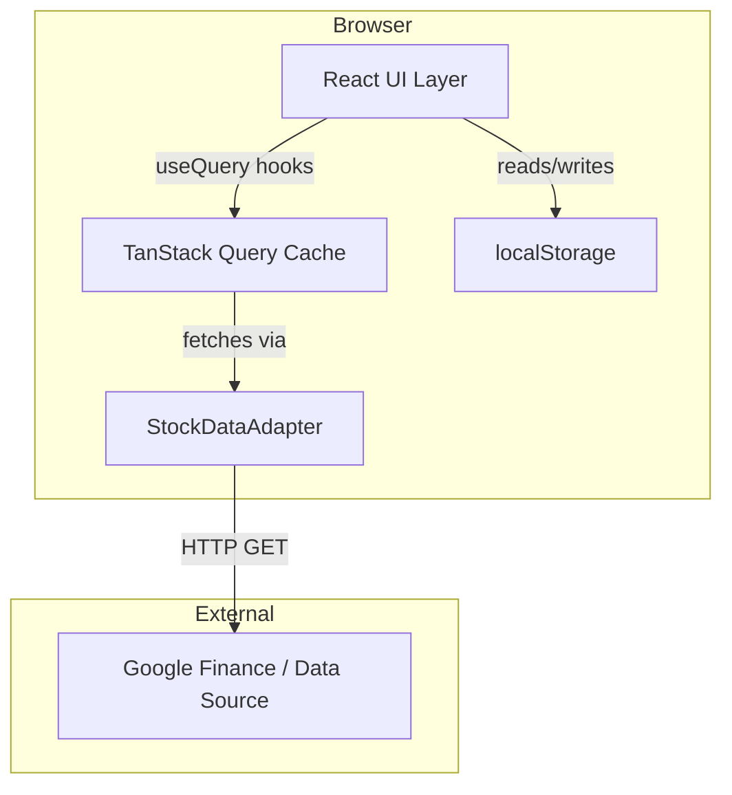

# Design Document: Stox Stock Ticker App

## Overview

Stox is a React + TypeScript single-page application that displays a live, scrollable table of stock tickers with key financial metrics sourced from Google Finance. Users can add/remove tickers, annotate rows with free-text interest notes, sort/filter/search the table, export data as CSV, and have their configuration persisted across sessions via browser localStorage.

The app is a pure client-side SPA with no backend. All data fetching is done directly from the browser using TanStack Query, which manages caching, background refresh, and loading/error states. Computed columns (Book Value, P:Book, Tangible Book Value, P:Tangbook, 20x EPS, 15x EPS, Price/Earnings) are derived in the client from raw fetched values.

### Key Design Decisions

- **No backend proxy**: Google Finance data is fetched directly from the browser. Because Google Finance does not expose a public JSON API, data is scraped from the Google Finance page HTML or via a CORS-friendly proxy approach. The design uses a thin `StockDataAdapter` that abstracts the data source so it can be swapped (e.g., Yahoo Finance JSON API as a fallback).
- **localStorage for persistence**: Ticker list and Interest annotations are stored in localStorage as JSON. No server-side persistence is needed.
- **TanStack Query**: Manages per-ticker fetch state, caching, and the 60-second auto-refresh interval via `refetchInterval`.
- **Vite**: Build tool for fast HMR and simple project setup.

---

## Architecture



### Layer Responsibilities

| Layer | Responsibility |
|---|---|
| UI Components | Render table, handle user interactions, display loading/error states |
| TanStack Query | Fetch orchestration, caching, background refresh (60s), per-ticker query state |
| StockDataAdapter | Abstract data source; parse raw response into `RawStockData` |
| Computed Column Logic | Pure functions that derive computed fields from `RawStockData` |
| localStorage Service | Read/write ticker list and interest annotations |
| CSV Exporter | Generate CSV string from current table rows |

---

## Components and Interfaces

### Component Tree

```
App
├── TickerTable
│   ├── ToolBar
│   │   ├── SearchInput
│   │   ├── AddTickerForm
│   │   └── ExportButton
│   ├── TableHeader (sortable column headers)
│   └── StockRow[] (one per ticker)
│       └── InterestCell (editable inline)
└── EmptyState
```

### Key Component Interfaces

```typescript
// ToolBar props
interface ToolBarProps {
  searchQuery: string;
  onSearchChange: (q: string) => void;
  onAddTicker: (symbol: string) => void;
  onExport: () => void;
  hasData: boolean;
}

// TableHeader props
interface TableHeaderProps {
  sortColumn: ColumnKey | null;
  sortDirection: 'asc' | 'desc';
  onSort: (col: ColumnKey) => void;
}

// StockRow props
interface StockRowProps {
  ticker: string;
  data: StockRowData | null;
  isLoading: boolean;
  isError: boolean;
  interest: string;
  onInterestChange: (ticker: string, value: string) => void;
  onRemove: (ticker: string) => void;
}
```

### Custom Hooks

| Hook | Purpose |
|---|---|
| `useTickerList()` | Read/write ticker list from localStorage; returns `[tickers, addTicker, removeTicker]` |
| `useInterestMap()` | Read/write interest annotations from localStorage; returns `[interestMap, setInterest]` |
| `useStockData(ticker)` | TanStack Query wrapper per ticker with 60s `refetchInterval`; returns `{ data: RawStockData, isLoading, isError }` |
| `useTableState()` | Manages search query, sort column, sort direction |

---

## Data Models

### RawStockData

Raw values returned from the data adapter (all optional to handle fetch failures):

```typescript
interface RawStockData {
  ticker: string;
  price: number | null;
  date: string | null;            // ISO date string of last fetch
  divYield: number | null;        // decimal, e.g. 0.0708 for 7.08%
  eps: number | null;
  totalAssets: number | null;     // in millions
  goodwillNet: number | null;     // in millions
  intangiblesNet: number | null;  // in millions
  liabilitiesTotal: number | null;// in millions
  sharesOutstanding: number | null;// in millions
  dividendPercent: number | null; // decimal, e.g. 0.0221 for 2.21%
}
```

### StockRowData (computed)

Derived from `RawStockData` by `computeStockRow()`:

```typescript
interface StockRowData {
  ticker: string;
  price: number | null;
  date: string | null;
  divYield: number | null;
  eps: number | null;
  totalAssets: number | null;
  goodwillNet: number | null;
  intangiblesNet: number | null;
  liabilitiesTotal: number | null;
  sharesOutstanding: number | null;
  bookValue: number | null;             // (totalAssets - liabilitiesTotal) / sharesOutstanding
  pBook: number | null;               // price / bookValue
  tangibleBookValue: number | null;   // bookValue - (goodwillNet + intangiblesNet) / sharesOutstanding
  pTangbook: number | null;           // price / tangibleBookValue
  dividendPercent: number | null;
  eps20x: number | null;              // 20 * eps
  eps15x: number | null;              // 15 * eps
  priceEarnings: number | null;       // price / eps
  interest: string;
}
```

### ColumnKey

```typescript
type ColumnKey =
  | 'ticker' | 'price' | 'date' | 'divYield' | 'eps'
  | 'totalAssets' | 'goodwillNet' | 'intangiblesNet' | 'liabilitiesTotal'
  | 'sharesOutstanding' | 'bookValue' | 'pBook' | 'tangibleBookValue'
  | 'pTangbook' | 'dividendPercent' | 'eps20x' | 'eps15x'
  | 'priceEarnings' | 'interest';
```

### Column Metadata

```typescript
interface ColumnDef {
  key: ColumnKey;
  label: string;           // display header matching Requirement 2.3
  type: 'text' | 'currency' | 'percent' | 'ratio' | 'large-number';
  sortType: 'alpha' | 'numeric';
}
```

The 19 columns in order:

| # | Key | Label | Type | Sort |
|---|---|---|---|---|
| 1 | ticker | Ticker | text | alpha |
| 2 | price | Price | currency | numeric |
| 3 | date | Date | text | alpha |
| 4 | divYield | Div Yield | percent | numeric |
| 5 | eps | EPS | currency | numeric |
| 6 | totalAssets | Total Assets | large-number | numeric |
| 7 | goodwillNet | Goodwill, Net | large-number | numeric |
| 8 | intangiblesNet | Intangibles, Net | large-number | numeric |
| 9 | liabilitiesTotal | Liabilities (Total) | large-number | numeric |
| 10 | sharesOutstanding | Shares (Total Common Outstanding) | large-number | numeric |
| 11 | bookValue | Book Value | currency | numeric |
| 12 | pBook | P:Book | ratio | numeric |
| 13 | tangibleBookValue | Tangable Book Value | currency | numeric |
| 14 | pTangbook | P:Tangbook | ratio | numeric |
| 15 | dividendPercent | Dividend Percent | percent | numeric |
| 16 | eps20x | 20x EPS | currency | numeric |
| 17 | eps15x | 15x EPS | currency | numeric |
| 18 | priceEarnings | Price/Earnings | ratio | numeric |
| 19 | interest | Interest | text | alpha |

### localStorage Schema

```typescript
// Key: "stox:tickers"
type TickerListStorage = string[];  // e.g. ["AAPL", "MSFT"]

// Key: "stox:interest"
type InterestStorage = Record<string, string>;  // e.g. { "AAPL": "BUY", "MSFT": "WATCH" }
```

### Number Formatting Rules

| Type | Format | Example |
|---|---|---|
| currency | `$X.XX` or `($X.XX)` for negatives | `$320.30`, `($6.51)` |
| percent | `X.XX%` | `7.08%` |
| ratio | `X.XX` or `(X.XX)` for negatives | `27.05`, `(181.70)` |
| large-number | Abbreviated with K/M/B/T suffix, currency prefix | `$56.1B`, `723` |
| N/A | `"N/A"` | division by zero or null |


---

## Correctness Properties

*A property is a characteristic or behavior that should hold true across all valid executions of a system — essentially, a formal statement about what the system should do. Properties serve as the bridge between human-readable specifications and machine-verifiable correctness guarantees.*

### Property 1: Computed columns are consistent with raw data

*For any* `RawStockData` value, the `computeStockRow()` function must produce:
- `bookValue = (totalAssets - liabilitiesTotal) / sharesOutstanding` (or `null` when sharesOutstanding is 0 or null, or when totalAssets or liabilitiesTotal is null)
- `pBook = price / bookValue` (or `null` when bookValue is 0 or null)
- `tangibleBookValue = bookValue - (goodwillNet + intangiblesNet) / sharesOutstanding` (or `null` when any input is null or sharesOutstanding is 0)
- `pTangbook = price / tangibleBookValue` (or `null` when tangibleBookValue is 0 or null)
- `eps20x = 20 * eps` (or `null` when eps is null)
- `eps15x = 15 * eps` (or `null` when eps is null)
- `priceEarnings = price / eps` (or `null` when eps is 0 or null)

**Validates: Requirements 4.1, 4.2, 4.3, 4.4, 4.5, 4.6, 4.7, 4.8, 4.9**

### Property 2: Number formatting round-trip

*For any* finite numeric value, formatting it with the appropriate formatter (currency, ratio, percent, large-number) and then parsing the formatted string back (stripping `$`, `%`, parentheses, commas, and K/M/B/T suffixes) must yield a value numerically close to the original (within rounding tolerance of the display precision).

**Validates: Requirements 7.1, 7.2, 7.3, 7.4**

### Property 3: Negative values use parentheses notation

*For any* negative numeric value formatted as currency or ratio, the resulting string must be wrapped in parentheses `(...)` and must not contain a leading minus sign.

**Validates: Requirements 7.6**

### Property 4: Ticker list localStorage round-trip

*For any* array of non-empty ticker symbol strings, saving it to localStorage via the ticker list service and reading it back must produce an identical array (same symbols, same order).

**Validates: Requirements 5.2, 8.1, 8.2**

### Property 5: Interest annotation localStorage round-trip

*For any* map of ticker symbol to interest string, saving it to localStorage via the interest service and reading it back must produce an identical map.

**Validates: Requirements 12.2, 12.3**

### Property 6: Adding a valid ticker grows the list by one

*For any* ticker list and a valid new ticker symbol (non-empty, not already in the list), adding it must result in the list length increasing by exactly one and the new symbol appearing in the list.

**Validates: Requirements 11.1, 11.5**

### Property 7: Invalid and duplicate ticker additions are rejected

*For any* ticker list, attempting to add an empty string or a symbol already present in the list must leave the list completely unchanged (same length, same contents).

**Validates: Requirements 11.2, 11.3**

### Property 8: Removing a ticker shrinks the list by one

*For any* ticker list containing a given symbol, removing that symbol must result in the list no longer containing it and the length decreasing by exactly one.

**Validates: Requirements 11.4, 11.6**

### Property 9: Search filter is case-insensitive and non-destructive

*For any* ticker list and search query string, the filtered result must contain only tickers whose symbol includes the query (case-insensitive), and the underlying stored ticker list must remain unchanged after filtering.

**Validates: Requirements 10.1, 10.7**

### Property 10: Sorting produces correct order and is reversible

*For any* list of `StockRowData` values and any sortable column, sorting ascending must produce rows in non-decreasing order by that column (numeric for numeric columns, lexicographic for text columns). Sorting descending must produce the reverse order. The underlying stored ticker list must remain unchanged.

**Validates: Requirements 10.2, 10.3, 10.5, 10.6, 10.7**

### Property 11: CSV export contains all rows and all 19 columns

*For any* non-empty list of `StockRowData` values, the generated CSV must have exactly one header row with all 19 column names in the order specified in Requirement 2.2, followed by exactly one data row per `StockRowData`, with each cell matching the displayed formatted value (including the Interest column).

**Validates: Requirements 9.2, 9.3, 12.4**

### Property 12: CSV filename includes ISO 8601 timestamp

*For any* export triggered at a given moment, the generated filename must match the pattern `stox-export-{ISO8601}.csv` where the timestamp portion is a valid ISO 8601 date-time string.

**Validates: Requirements 9.4**

---

## Error Handling

| Scenario | Behavior |
|---|---|
| Fetch fails for a ticker | Show error indicator in that row; other rows unaffected; TanStack Query retries per default policy |
| Fetch in progress | Show loading skeleton/spinner in affected rows; last successful data remains visible during refresh |
| No tickers configured | Show empty state message: "No tickers configured. Add a ticker above." |
| Empty ticker input | Show inline validation: "Ticker symbol cannot be empty." |
| Duplicate ticker input | Show inline validation: "Ticker already in list." |
| No data for CSV export | Disable export button; show tooltip: "No data to export." |
| localStorage unavailable | Gracefully degrade: use in-memory state only; no crash |
| Division by zero in computed columns | Return `null` from `computeStockRow()`; render "N/A" in the cell |
| Null/missing field from data source | Return `null` for that field; render "N/A" in the cell |

---

## Testing Strategy

### Dual Testing Approach

Both unit tests and property-based tests are required. They are complementary:
- **Unit tests**: Verify specific examples, edge cases, integration points, and error conditions
- **Property-based tests**: Verify universal correctness properties across all valid inputs

### Unit Tests

Focus areas:
- `computeStockRow()`: specific examples including negative book value, zero EPS, all-null fields
- `formatValue()`: specific formatting examples for each column type (currency, ratio, percent, large-number)
- `localStorageService`: read/write/fallback when localStorage is empty or unavailable
- `csvExporter`: known input → known CSV output string
- `TickerTable` component: renders correct number of rows, empty state, loading state, error state
- `AddTickerForm`: validation messages for empty and duplicate input
- `SearchInput`: filters rows correctly for a known dataset
- `InterestCell`: editable, persists on change

### Property-Based Tests

**Library**: `fast-check` (TypeScript-native, well-maintained, integrates with Vitest)

**Configuration**: Minimum **100 iterations** per property test.

Each test must include a comment tag in the format:
`// Feature: stox-stock-ticker-app, Property {N}: {property_text}`

Each correctness property (Properties 1–12) must be implemented by a single property-based test.

| Property | Test Description |
|---|---|
| P1 | Generate arbitrary `RawStockData`; verify all computed fields match their formulas: bookValue = (totalAssets - liabilitiesTotal) / sharesOutstanding, pBook = price / bookValue, tangibleBookValue = bookValue - (goodwillNet + intangiblesNet) / sharesOutstanding, pTangbook = price / tangibleBookValue, eps20x = 20 * eps, eps15x = 15 * eps, priceEarnings = price / eps (including null when divisor is 0/null) |
| P2 | Generate arbitrary finite numbers; format with each formatter type then parse back; verify numeric equivalence within tolerance |
| P3 | Generate arbitrary negative numbers; format as currency/ratio; verify parentheses wrapping and no minus sign |
| P4 | Generate arbitrary string arrays; save to localStorage ticker service; read back; verify deep equality |
| P5 | Generate arbitrary ticker→interest maps; save to localStorage interest service; read back; verify deep equality |
| P6 | Generate ticker list + valid new symbol (non-empty, not in list); add; verify length+1 and symbol present |
| P7 | Generate ticker list; attempt add of empty string or existing symbol; verify list unchanged |
| P8 | Generate ticker list with at least one symbol; pick one; remove; verify length-1 and symbol absent |
| P9 | Generate ticker list + query string; filter; verify all results contain query (case-insensitive) and original list unchanged |
| P10 | Generate list of StockRowData + column; sort asc; verify non-decreasing order; sort desc; verify non-increasing order |
| P11 | Generate list of StockRowData; export CSV; verify header has 19 columns in order, data row count matches, cells match formatted values |
| P12 | Generate Date; build export filename; verify it matches `stox-export-{ISO8601}.csv` pattern |

### Data Source Note

Google Finance does not provide a public JSON API. The `StockDataAdapter` will use one of:
1. A Vite dev-proxy to Yahoo Finance's `/v8/finance/chart/{ticker}` endpoint (free, no auth, returns JSON with price and fundamentals)
2. A scraping approach against Google Finance HTML

The adapter interface is kept abstract so the source can be swapped without affecting the rest of the app.
